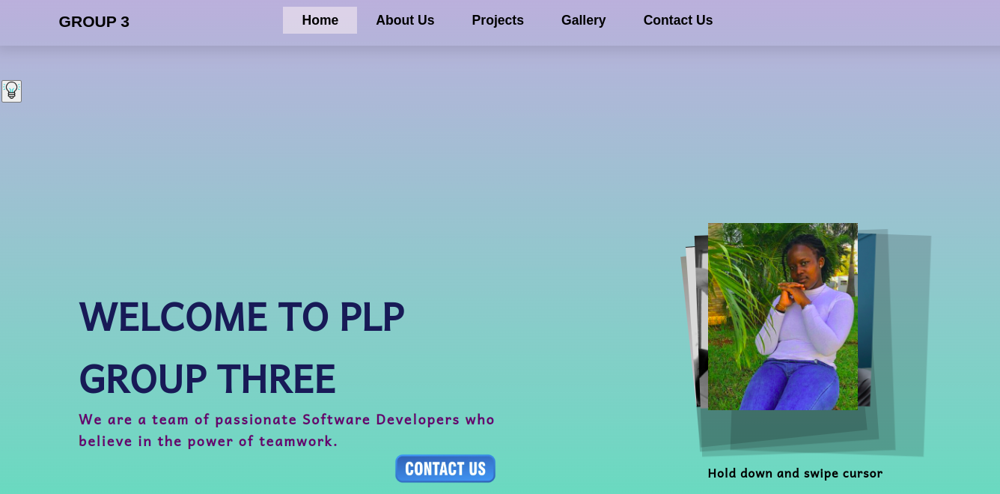
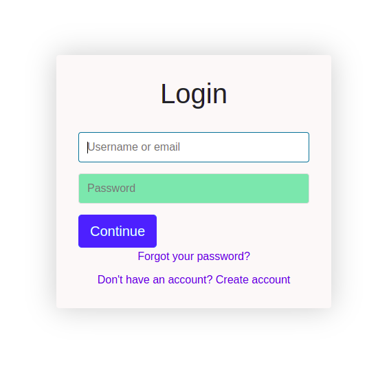
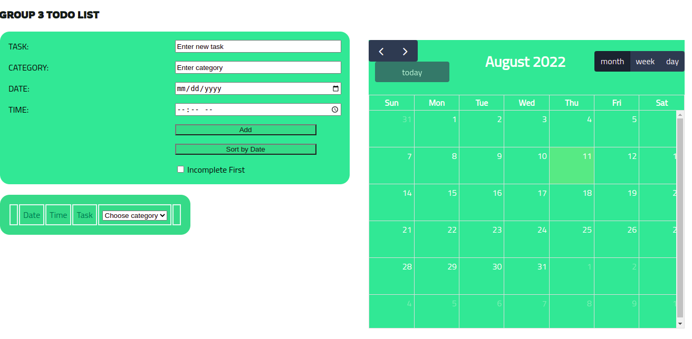
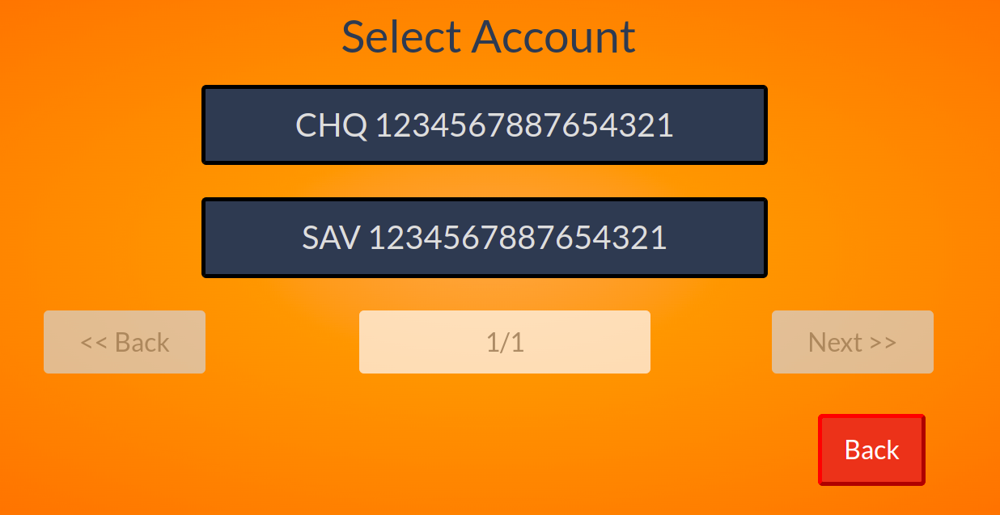

## PLP GROUP 3 WEB HACKATHON
This is a web hackathon to engage students to get to collaborate in doing web development of the project as specified below

### Technologies Used
* HTML
* Javascript
* CSS
* Bootstrap

### Tasks done 
1. [PORTFOLIO WEBSITE CHALLENGE](https://waasike.github.io/hackathon_portfolio/)

2. [AUTHENTICATION SYSTEM](https://waasike.github.io/hackathon_authentication/)

3. [TODO LIST CHALLENGE](https://waasike.github.io/hackathon_todolist/)

4. [ATM PROGRAM CHALLENGE](https://waasike.github.io/hackathon_atm/)

### Task Description
1. PORTFOLIO WEBSITE CHALLENGE

* Make the logo as your group number.
* Make a responsive navigation bar such that it can be accessible in mobile and large
screens.
* Make use of simple Javascript such that when on small screen device an
humbugger menu appears, when one clicks the menu, all the menu details are
displayed. And the ability to close the menu or the drop-down.
* On the images, add your group members image with a little description.

* Make use of great colors to make the website as attractive as possible.
* Be as creative as possible.

3. TODO LIST CHALLENGE
Create a To-Do List program that does the following:
* Authenticate the user. Use the authentication system you created in the previous
challenge number 2.
* Ability to add a To-Do with 3 input field, Todo-title, the actual to-do item, and
Date/ or time to perform the To-Do.
* Display the To-Do Item on the browser.
* Mark and un-mark a To-Do as complete or.
* Ability to delete a specific or selected To-Do Item.
* Update or Edit a To-Do Item.

4. ATM PROGRAM CHALLENGE
Write an ATM program that has the following functionalities.
* Login with password to start the program.
* Check existing Account balance.
* Ability to Top-Up your account.
* Ability to withdraw a certain amount.
* Create a Button to Exit the program.
* After exiting the program show the user the last date when the user exited the
program/ATM
* Save the transaction details in an array and ability to download the transaction
details or print a receipt.

### Group Members 
Stephen Nderitu
Mitchelle Wasike
Beatrice Wanjiru
Gregory Opondi
David Omondi

